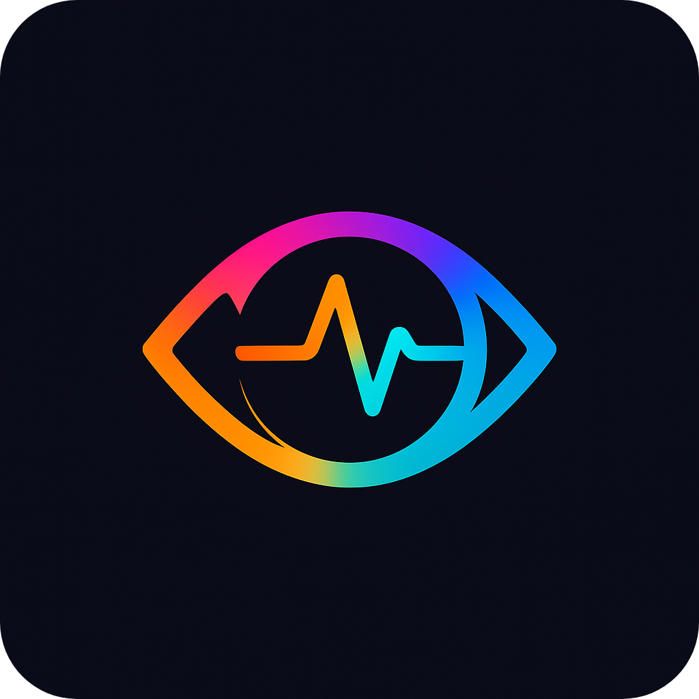
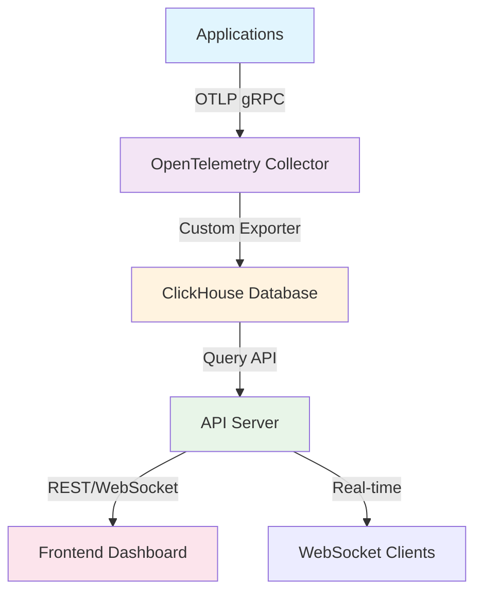

<div align="center">
  
  
  # WatchData
  
  **🔍 Lightweight Observability Platform for Modern Applications**
  
  [](https://golang.org)
  [](https://opentelemetry.io)
  [](https://clickhouse.com)
  [](https://opensource.org/licenses/MIT)
  [](https://docker.com)
  
  *Collect, store, and explore your application's telemetry data with ease*
  
</div>

---

## ✨ What is WatchData?

WatchData is a **high-performance, open-source observability platform** designed for developers who need powerful monitoring without the complexity. Built on OpenTelemetry standards and powered by ClickHouse, it provides real-time insights into your applications' logs, metrics, and traces.

### 🎯 Perfect For
- **Solo Developers** building side projects
- **Small Teams** needing cost-effective monitoring  
- **Learning** observability concepts hands-on
- **Prototyping** before scaling to enterprise solutions

---

## 🚀 Key Features

<table>
<tr>
<td width="50%">

### 📊 **Data Collection**
- **OpenTelemetry Protocol (OTLP)** support
- **Multiple ingestion methods** (gRPC, HTTP, files)
- **Real-time processing** with batching
- **Auto-discovery** of telemetry data

</td>
<td width="50%">

### ⚡ **High Performance**
- **ClickHouse backend** for blazing-fast queries
- **Columnar storage** with compression
- **Time-series optimization** 
- **Horizontal scaling** ready

</td>
</tr>
<tr>
<td width="50%">

### 🎨 **Modern UI**
- **Real-time dashboards** with WebSocket updates
- **Interactive log exploration**
- **Time-range filtering**
- **Responsive design** for all devices

</td>
<td width="50%">

### 🔧 **Developer Experience**
- **Docker Compose** for instant setup
- **Comprehensive APIs** for integration
- **Extensive documentation**
- **Active community** support

</td>
</tr>
</table>

---

## 🏗️ Architecture



**Learn more:** [📖 Architecture Documentation](docs/arcitechture.md)

---

## ⚡ Quick Start

### Prerequisites
- **Docker & Docker Compose** (recommended)
- **Go 1.24+** (for development)
- **Node.js 18+** (for frontend development)

### 🐳 Docker Setup (Recommended)

```bash
# Clone the repository
git clone https://github.com/Ricky004/watchdata.git
cd watchdata

# Start all services
make up

# Check logs
make logs

# Your services are now running:
# - ClickHouse: http://localhost:8123
# - Collector: grpc://localhost:4317  
# - API Server: http://localhost:8080
# - Frontend: http://localhost:3000
```

### 🛠️ Development Setup

```bash
# Setup development environment
make dev-setup

# Build all components
make build

# Run server (in one terminal)
make run-server

# Send test data (in another terminal)  
make run-client
```

---

## 📡 Sending Data

### Using OpenTelemetry SDKs

<details>
<summary><strong>🟢 Node.js Example</strong></summary>

```javascript
const { NodeSDK } = require('@opentelemetry/sdk-node');
const { OTLPLogExporter } = require('@opentelemetry/exporter-logs-otlp-grpc');

const sdk = new NodeSDK({
  logRecordProcessor: new BatchLogRecordProcessor(
    new OTLPLogExporter({
      url: 'http://localhost:4317',
    })
  ),
});

sdk.start();

// Your application logs will now be sent to WatchData
console.log('Hello from my application!');
```

</details>

<details>
<summary><strong>🔵 Python Example</strong></summary>

```python
from opentelemetry import logs
from opentelemetry.exporter.otlp.proto.grpc._log_exporter import OTLPLogExporter
from opentelemetry.sdk.logs import LoggerProvider, LoggingHandler
from opentelemetry.sdk.logs.export import BatchLogRecordProcessor

# Configure OpenTelemetry
logs.set_logger_provider(LoggerProvider())
exporter = OTLPLogExporter(endpoint="http://localhost:4317", insecure=True)
logs.get_logger_provider().add_log_record_processor(
    BatchLogRecordProcessor(exporter)
)

# Your application logs will now be sent to WatchData
import logging
logging.info("Hello from my Python application!")
```

</details>

<details>
<summary><strong>🟡 Go Example</strong></summary>

```go
package main

import (
    "context"
    "go.opentelemetry.io/otel/exporters/otlp/otlplog/otlploggrpc"
    "go.opentelemetry.io/otel/log/global"
    "go.opentelemetry.io/otel/sdk/log"
)

func main() {
    exporter, _ := otlploggrpc.New(context.Background(),
        otlploggrpc.WithEndpoint("http://localhost:4317"),
        otlploggrpc.WithInsecure(),
    )
    
    processor := log.NewBatchProcessor(exporter)
    provider := log.NewLoggerProvider(log.WithProcessor(processor))
    global.SetLoggerProvider(provider)
    
    // Your application logs will now be sent to WatchData
    logger := global.GetLoggerProvider().Logger("my-app")
    logger.Emit(context.Background(), log.Record{
        Body: log.StringValue("Hello from my Go application!"),
    })
}
```

</details>

### Using the Built-in Client

```bash
# Send test logs
make run-client

# Or run directly
go run cmd/client/main.go
```

---

## 🎛️ API Reference

### REST Endpoints

| Method | Endpoint | Description |
|--------|----------|-------------|
| `GET` | `/v1/logs` | Retrieve recent logs |
| `GET` | `/v1/logs/since?timestamp=<unix>` | Get logs since timestamp |
| `GET` | `/v1/logs/timerange?start=<unix>&end=<unix>` | Query logs in time range |

### WebSocket

```javascript
// Real-time log streaming
const ws = new WebSocket('ws://localhost:8080/ws');
ws.onmessage = (event) => {
  const logData = JSON.parse(event.data);
  console.log('New log:', logData);
};
```

---

## 🔧 Configuration

### Environment Variables

```bash
# ClickHouse Configuration
CLICKHOUSE_HOST=localhost
CLICKHOUSE_PORT=9000
CLICKHOUSE_USER=default
CLICKHOUSE_PASSWORD=pass

# Server Configuration  
SERVER_PORT=8080
LOG_LEVEL=info
```

### Custom Collector Config

Edit `configs/otel-collector-config.yaml`:

```yaml
receivers:
  otlp:
    protocols:
      grpc:
        endpoint: 0.0.0.0:4317

exporters:
  watchdataexporter:
    dsn: "tcp://clickhouse:9000/default?username=default&password=pass"
    
service:
  pipelines:
    logs:
      receivers: [otlp]
      exporters: [watchdataexporter]
```

---

## 📊 Performance

WatchData is built for performance:

- **🚀 10,000+ logs/second** ingestion rate
- **⚡ Sub-second** query response times  
- **💾 90% compression** ratio with ClickHouse
- **🔄 Real-time** WebSocket updates
- **📈 Horizontal scaling** support

---

## 🛣️ Roadmap

### 🎯 Current Focus (v1.0)
- [x] OpenTelemetry log ingestion
- [x] ClickHouse storage backend
- [x] REST API with WebSocket support
- [x] Docker Compose deployment
- [ ] Frontend dashboard (Next.js)
- [ ] Authentication & authorization

### 🔮 Future Plans (v2.0+)
- [ ] **Metrics support** (Prometheus-compatible)
- [ ] **Distributed tracing** visualization
- [ ] **Alerting system** with webhooks
- [ ] **Multi-tenancy** support
- [ ] **Kubernetes operator**
- [ ] **Advanced analytics** and ML insights

---

## 🤝 Contributing

We love contributions! Here's how you can help:

### 🐛 Found a Bug?
[Open an issue](https://github.com/Ricky004/watchdata/issues/new?template=bug_report.md) with details

### 💡 Have an Idea?
[Start a discussion](https://github.com/Ricky004/watchdata/discussions) to share your thoughts

### 🔧 Want to Code?
1. **Fork** the repository
2. **Create** a feature branch: `git checkout -b feature/amazing-feature`
3. **Commit** your changes: `git commit -m 'Add amazing feature'`
4. **Push** to the branch: `git push origin feature/amazing-feature`
5. **Open** a Pull Request

**Read our [Contributing Guide](CONTRIBUTING.md) for detailed instructions.**

---

## 📚 Documentation

- [🏗️ Architecture Overview](docs/arcitechture.md)
- [⚙️ Configuration Guide](docs/configuration.md)
- [🚀 Deployment Guide](docs/deployment.md)
- [🔌 API Documentation](docs/api.md)
- [🧪 Testing Guide](docs/testing.md)

---

## 💬 Community & Support

<div align="center">

[](https://github.com/Ricky004/watchdata/discussions)
[](https://github.com/Ricky004/watchdata/issues)

</div>

- **💬 Questions?** Use [GitHub Discussions](https://github.com/Ricky004/watchdata/discussions)
- **🐛 Bug Reports:** [GitHub Issues](https://github.com/Ricky004/watchdata/issues)
- **📧 Email:** [tridipdam001@gmail.com](mailto:tridipdam001@gmail.com)

---

## 📄 License

This project is licensed under the **MIT License** - see the [LICENSE](LICENSE) file for details.

---

<div align="center">

**⭐ Star this repo if you find it useful!**

Made with ❤️ by [Tridip Dam](https://github.com/Ricky004) and [contributors](https://github.com/Ricky004/watchdata/contributors)

</div>
